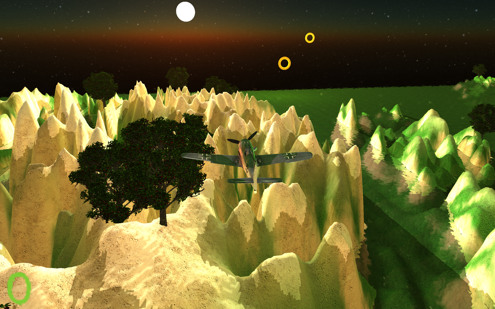
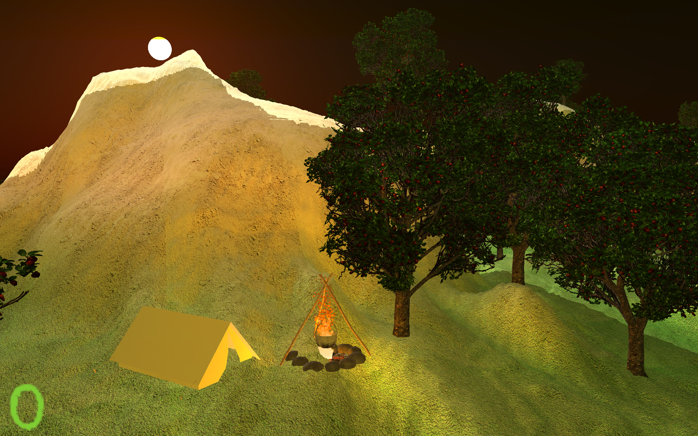

# Flight Simulator

## Presentation of the project

This project is a flight simulator that aims to learn multiple techniques in OpenGL. The goal of the game is to collect as many rings possible.

## 🌟 Features

- Reflection and Refraction in the water
- Frustum Culling
- Particles for the firecamp
- Instancing of the trees
- Skybox for the night
- Lights
- Atmospheric Model
- Shadows

## 🖼️ Images





## ⬇️ Installation
### Prerequisites
To run this project, you will need
- [https://freetype.org/](freetype)
- [https://www.assimp.org/](assimp)
- [https://www.sfml-dev.org/](sfml)
- [https://www.opengl.org/](openGL)

### Installation
```rm -rf build && cmake -DCMAKE_EXPORT_COMPILE_COMMANDS:BOOL=TRUE -DCMAKE_BUILD_TYPE=Debug -S . -B build -G Ninja &&  cmake --build build```

### Usage
```./build/VRproject```

### Controls

⬅️➡️⬆️⬇️ = To control the camera

`Z`,`Q`,`S`,`D` = To control the plane

`T` = Toggle the camera or the plane 

## Acknowledgments
Thanks to these websites for the models:
- Plane: https://www.cgtrader.com/free-3d-models/military/military-vehicle/focke-wulf-fw-190-d-9-dora-3d-model-wwii-german-fighter
- Campfire: https://www.cgtrader.com/free-3d-models/exterior/exterior-public/campfire-a6dfe064-3e9e-497f-97e4-7b3195effa79
- AppleTree: https://www.cgtrader.com/free-3d-models/plant/leaf/apple-tree-d7daa804-0643-4496-bb53-06b73a6368ec
- Font: https://all-free-download.com/font/download/gabriele_ribbon_fg_6918761.html